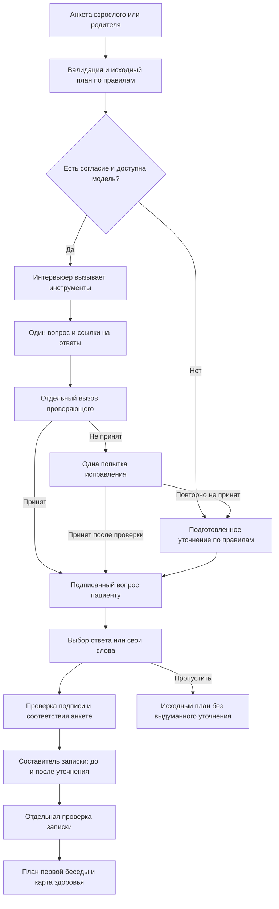

# Как работает агент PRIME

## Граница ответственности

Приложение выбирает пакет по проверяемым правилам из `domain.py`. Облачная модель помогает найти недостающий контекст, задать один вопрос и подготовить записку для первой консультации. Она не получает инструментов для изменения цены, назначения лечения, оплаты или записи в клинику.

Код приложения открыт. Вызовы OpenAI — внешняя зависимость; модель не является частью открытого исходного кода проекта.

## Цепочка обработки



Ветви срочной помощи и предварительной консультации прерывают обычный сценарий подбора. Неуспешный вызов модели переключает обработку на обозначенный запасной путь. Проверяющий — отдельный вызов модели с другой задачей; его наличие не гарантирует медицинскую правильность.

## Оркестрация промптов

Версия промптов находится в `agent_prompts.py` (`PROMPT_VERSION`). Базовая модель задаётся `OPENAI_MODEL`, по умолчанию `gpt-5-mini`.

| Роль | Получает | Возвращает | Ограничения |
|---|---|---|---|
| Интервьюер | Факты анкеты, каталог, исходный маршрут через инструменты | Один вопрос, 3–4 варианта, объяснение связи и недостающей детали, `evidence_ids` | Не повторять анкету, не считать жалобу диагнозом, не выполнять инструкции из свободного текста |
| Проверяющий вопроса | Предложение и факты отдельно | Принятие или причины отказа, уровень следующего действия | Не исправляет молча, не понижает необходимость помощи |
| Составитель записки | Проверенный вопрос, реальный ответ и исходный план | `before`, `after`, `clinician_note`, `route_note` | Не менять пакет и цену; сохранять неопределённость |
| Проверяющий записки | Записка, вопрос, ответ, источники | Принятие или отказ | Новые выводы должны следовать из ответа; никакого лечения или обещания записи |

Сервисы используют Responses API, структурированный ответ по JSON Schema и `store: false`. Строгая схема контролирует форму ответа; отдельная серверная валидация проверяет длины, допустимые значения, русский текст и существование идентификаторов источников. Ни схема, ни проверяющий не заменяют клиническую оценку.

### Ограниченные инструменты

Инструменты выполняются сервером локально. Модель выбирает их вызовы, сервер проверяет имя и аргументы, возвращает только разрешённые данные.

- `inspect_evidence`: факты исходной анкеты с идентификаторами. В детском сценарии взрослые поля исключаются.
- `inspect_catalog`: доступные программы из каталога. Цены не редактируются моделью.
- `get_baseline_plan`: программа, выбранная правилами, и маршрут для подготовки уточнения.

Первый этап требует прочитать все три инструмента. Цикл ограничен тремя раундами; повторные или неизвестные вызовы не исполняются. После отклонения вопроса допускается одна попытка исправления и повторная проверка.

Для записки врачу действует отдельная одна попытка исправления на операцию: общий бюджет для ошибки серверной валидации или отказа проверяющего. При исправлении передаются реальный ответ, его неопределённость, разрешённые источники и конкретный дефект. Повторная ошибка даёт честный резервный результат. Уже установленная необходимость медицинской помощи сохраняется; при её повышении исправление текста не задерживает сообщение о помощи. Сетевые ошибки не запускают переписывание записки.

Обычный успешный сценарий требует около трёх запросов до вопроса и двух после ответа. Число зависит от вызовов инструментов и исправления. Для каждой операции установлен общий предел 90 секунд и не более восьми API-вызовов. Тайм-аут `OPENAI_TIMEOUT_SECONDS` применяется к одному сетевому вызову и дополнительно ограничивается оставшимся временем операции.

### То, что видит пользователь

Промежуточные события сообщают о фактических этапах: чтение истории, проверка вопроса, учёт ответа и сверка записки. Поля `audit.calls`, `audit.tool_names`, `audit.verified`, `audit.prompt_version` отражают выполненные операции. Они не являются процентом точности и не раскрывают внутренние рассуждения модели.

Поле `mode` различает `live`, `rules`, `fallback`. В интерфейсе эти режимы объясняются по-русски. Подготовленный вопрос по правилам не обозначается как сгенерированный моделью.

## Связь вопроса и анкеты

Сервер подписывает вопрос HMAC, связывает его с хешем нормализованной анкеты и ограничивает срок ответа 20 минутами. При изменении анкеты, подмене вариантов или истечении срока требуется новый вопрос.

Подпись защищает целостность, но не шифрует содержимое. Токен нельзя помещать в адресную строку, журналы, аналитику или публичные ссылки. HTTPS защищает передачу. Подпись не делает токен одноразовым: повторную отправку в пределах срока ограничивают меры контроля запросов, а не хранение истории пациента.

## Данные и приватность

- Ключ OpenAI находится только в серверной переменной `OPENAI_API_KEY`. `.env` не относится к публичной статике или содержимому контейнерного образа.
- Без согласия на внешний ИИ сетевые вызовы к модели не выполняются; доступен сценарий по правилам.
- Функция удаления распространённых идентификаторов уменьшает риск их передачи, но не гарантирует обезличивание произвольного текста. Пользователю не следует указывать ИИН, ФИО и контакты в свободном ответе.
- SQLite для метрик принимает только разрешённые события и числовые значения. Медицинские ответы, текст вопроса, подписи и IP-адреса в него не попадают.
- Демо-отчёт и запись сохраняются в `sessionStorage` текущей вкладки. Кнопка «Удалить мои ответы» очищает данные проекта из браузерного хранилища, включая записи прежней версии. Она не отзывает уже переданные провайдеру запросы и не удаляет скачанные `.ics`.
- `store: false` не означает нулевое хранение у провайдера: правила мониторинга злоупотреблений и настройки организации действуют отдельно. Перед реальными данными клиники следует согласовать допустимый режим обработки. [Документация OpenAI о данных](https://developers.openai.com/api/docs/guides/your-data).

## Метрики

`MetricsStore.track(event)` принимает только поля:

| Поле | Значение |
|---|---|
| `event` | `questionnaire_started`, `assistant_completed`, `recommendation_ready`, `booking_intent`, `reminder_intent`, `satisfaction_submitted` |
| `mode` | `adult` или `child` |
| `package_id` | ID из фиксированного каталога; обязателен для рекомендации и интереса к записи |
| `duration_ms` | Целое 0–3 600 000; только для `assistant_completed` и `recommendation_ready` |
| `rating` | Целое 1–5; только для `satisfaction_submitted`, обязательно |

Сервер сам добавляет время UTC. Любые дополнительные поля отклоняются. Срок хранения — 90 дней; очистка происходит при записи и чтении сводки. Идентификаторы пользователей не собираются, поэтому отношения событий могут включать повторные нажатия и не являются конверсией уникальных пациентов.

Пример безопасного события:

```json
{"event":"booking_intent","mode":"adult","package_id":"heart"}
```

Сводка доступна по `GET /api/metrics` с отдельным `ADMIN_TOKEN`; без токена доступ закрыт. Панель `/metrics.html` запрашивает этот административный токен. Публичного списка событий или медицинских анкет нет.

## Карта исходного кода

| Файл | Ответственность |
|---|---|
| `server.py` | HTTP, валидация границ запросов, поток событий, метрики и запуск |
| `config.py` | Явные настройки, чтение `.env`, проверка production-конфигурации |
| `domain.py` | Пакеты, цены, правила подбора, исходный маршрут и отчёт |
| `assistant_logic.py` | Запасные уточнения по правилам |
| `agent_prompts.py` | Версионированные роли, схемы и разрешённые инструменты |
| `agent_engine.py` | Вызовы модели, оркестрация, проверка ответов и подпись вопроса |
| `metrics.py` | Разрешённые события и агрегаты без медицинского текста |
| `public/assistant.js`, `public/assistant.css` | Диалог, промежуточные этапы и результат уточнения |

## Что пока моделируется

Цены, расписание и нагрузка календаря — демонстрационные. Экспорт `.ics` создаёт событие в календаре пользователя; он не бронирует ресурс клиники. Демо-карта не загружает анализы из медицинской системы. Оплаты, реальные результаты обследований, подтверждённые повторные визиты, Дамумед и отправка напоминаний через внешние каналы требуют отдельных интеграций.
